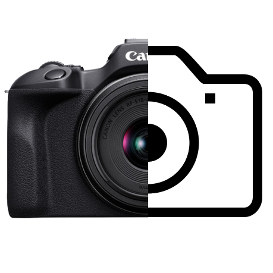

# InfinityVCam

**InfinityVCam** is a powerful Chrome Extension that creates a customizable virtual camera directly within your browser. It allows you to manipulate your webcam feed in real-time, adding overlays, text, and effects before the video reaches your video conferencing tools like Google Meet, Zoom, or Microsoft Teams.

## ✨ Key Features

### 🎥 Virtual Camera Control
*   **Universal Compatibility**: Creates a "Virtual Camera" device that appears in any web-based video application.
*   **Real-time Processing**: Uses the HTML5 Canvas API for low-latency video manipulation.
*   **Privacy Mode**: Displays a "No Signal" synthetic stream when your physical camera is off or disconnected.

### 🛠 Studio-Grade Tools
*   **Transformations**:
    *   **Zoom/Scale**: Smoothly zoom in ($0.2x$ to $3.0x$).
    *   **Pan**: Adjust the X and Y position to frame your shot perfectly.
    *   **Flip**: Mirror your video horizontally or vertically.
*   **Text Overlays**:
    *   Add multiple text layers.
    *   Customize font size, color, and position.
    *   Independent flipping for text elements (so your text remains readable even if you mirror your camera).
*   **Image Overlays**:
    *   Upload custom images (logos, watermarks, stickers).
    *   Resize and position them anywhere on the screen.

### 🎨 Modern UI
*   **Glassmorphic Design**: A clean, modern interface that fits right into your browser.
*   **Live Preview**: See your changes in real-time within the extension popup.

## 🚀 Installation Guide

Since this is a developer extension, you will need to install it in "Unpacked" mode.

1.  **Download** or clone this repository to your local machine.
2.  Open Google Chrome and navigate to `chrome://extensions/`.
3.  **Enable Developer Mode** by toggling the switch in the top-right corner.
4.  Click the **Load unpacked** button that appears.
5.  Select the root folder of this project (where `manifest.json` is located).
6.  The **InfinityVCam** icon should now appear in your browser toolbar.

## 📖 How to Use

### 1. Setting Up
*   Click the extension icon to open the control panel.
*   Select your physical webcam from the dropdown menu at the top.
*   If successfully connected, you will see your video feed in the preview window.

### 2. Customizing Your Feed
Use the tabs at the bottom to switch between modes:
*   **Canvas Tab**: Adjust Zoom, Pan (X/Y), and Mirror (Flip H/V) settings.
*   **Text Tab**: Type text and click "Add". Use the sliders to position and style each text element.
*   **Image Tab**: Click "Upload Image" to add a graphic. Use the controls to resize and place it.

### 3. Connecting to Video Calls (e.g., Google Meet)
1.  Open your video conferencing website.
2.  Go to the **Settings** > **Video** menu of that website.
3.  In the "Camera" dropdown, select **Virtual Camera**.
    *   *Note: If you don't see it immediately, refresh the meeting page after installing the extension.*

## 🔒 Privacy & Permissions

*   **Camera Access**: Required to capture your physical webcam feed for processing.
*   **Storage**: Used to save your configuration (zoom levels, overlay positions) locally so they persist between sessions.
*   **Scripting/ActiveTab**: Required to inject the virtual device driver into web pages so they can recognize the new camera source.

## 🛠 Technical Stack

*   **Frontend**: HTML5, CSS3 (Glassmorphism), Vanilla JavaScript.
*   **Core**: HTML5 Canvas 2D API for video frame processing.
*   **Extension API**: Chrome Manifest V3.

---

*Enjoy your enhanced video calls!*
