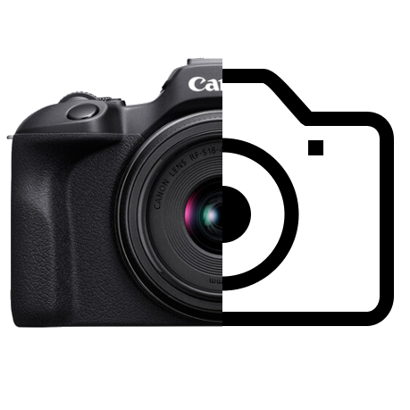

# Nori V Cam

**Nori V Cam** is a powerful Chrome Extension that creates a customizable virtual camera directly within your browser. It allows you to manipulate your webcam feed in real-time, adding overlays, text, and effects before the video reaches your video conferencing tools like Google Meet, Zoom, or Microsoft Teams.

## ✨ Key Features

### 🎥 Virtual Camera Control
*   **Universal Compatibility**: Creates a "Nori V Cam" virtual device that appears in any web-based video application.
*   **Real-time Processing**: Uses the HTML5 Canvas API for low-latency video manipulation.
*   **Privacy Mode**: Displays a "No Signal" synthetic stream when your physical camera is off or disconnected.

### 🛠 Studio-Grade Tools
*   **Transformations**:
    *   **Zoom/Scale**: Smoothly zoom in ($0.2x$ to $3.0x$).
    *   **Pan**: Adjust the X and Y position to frame your shot perfectly.
    *   **Flip**: Mirror your video horizontally or vertically.
*   **Text Overlays**:
    *   Add multiple text layers.
    *   Customize font size, color, and position.
    *   Independent flipping for text elements (so your text remains readable even if you mirror your camera).
*   **Image Overlays**:
    *   Upload custom images (logos, watermarks, stickers).
    *   Resize and position them anywhere on the screen.

### 🎨 Modern UI
*   **Glassmorphic Design**: A clean, consistent interface built on a shared design-token system, so every panel, button, and control looks and behaves the same way.
*   **Light & Dark Themes**: Toggle instantly from the header — your preference is remembered on next launch.
*   **Live Preview**: See your changes in real-time within the extension popup.

## 🚀 Installation Guide

Since this is a developer extension, you will need to install it in "Unpacked" mode.

1.  **Download** or clone this repository to your local machine.
2.  Open Google Chrome and navigate to `chrome://extensions/`.
3.  **Enable Developer Mode** by toggling the switch in the top-right corner.
4.  Click the **Load unpacked** button that appears.
5.  Select the root folder of this project (where `manifest.json` is located).
6.  The **Nori V Cam** icon should now appear in your browser toolbar.

## 📖 How to Use

### 1. Setting Up
*   Click the extension icon to open the control panel.
*   Select your physical webcam from the dropdown menu at the top.
*   If successfully connected, you will see your video feed in the preview window.
*   Use the sun/moon toggle in the header to switch between light and dark themes.

### 2. Customizing Your Feed
Use the tabs at the bottom to switch between modes:
*   **Canvas Tab**: Adjust Zoom, Pan (X/Y), and Mirror (Flip H/V) settings.
*   **Text Tab**: Type text and click "Add". Use the sliders to position and style each text element.
*   **Image Tab**: Click "Upload Image" to add a graphic. Use the controls to resize and place it.

### 3. Connecting to Video Calls (e.g., Google Meet)
1.  Open your video conferencing website.
2.  Go to the **Settings** > **Video** menu of that website.
3.  In the "Camera" dropdown, select **Nori V Cam**.
    *   *Note: If you don't see it immediately, refresh the meeting page after installing the extension.*

## 🔒 Privacy & Permissions

*   **Camera Access**: Required to capture your physical webcam feed for processing.
*   **Storage**: Used to save your configuration (zoom levels, overlay positions, theme) locally so they persist between sessions.
*   **Scripting/ActiveTab**: Required to inject the virtual device driver into web pages so they can recognize the new camera source.

## 🛠 Technical Stack

*   **Frontend**: HTML5, CSS3 (Glassmorphism + CSS custom properties for theming), Vanilla JavaScript.
*   **Core**: HTML5 Canvas 2D API for video frame processing.
*   **Extension API**: Chrome Manifest V3.

---

## 🚀 About Omnori

**Building Products With No End.**

[Instagram](https://www.instagram.com/omnori.tech) · [GitHub](https://github.com/omnori) · [Discord](https://discord.gg/5ag9gjsDde)

We are a relentless product lab. We build software, automation, and productivity tools of every kind — listening to your friction, prototyping rapidly, and shipping continuously. The cycle never stops. Everything we ship is released as open source under libre licenses, for anyone to use, inspect, and build on.

**Our Mission**: To continuously iterate and ship products that make life, work, and development a little bit easier.

### What We're Building

| Status | Product | Description |
|---|---|---|
| 🟢 | **Nori V Cam** | Chrome extension camera app — overlays, filters, and zoom (this repo) |
| 🟢 | **Pomori** | Chrome extension Pomodoro timer |

**In the pipeline**: Notes101 (a Discord bot that records voice meetings and auto-generates notes) and a Link Shortener are both in active development.

### Get Involved

We build what the community asks for. Have a frustrating workflow, or wish a specific tool existed? Drop a pitch, check the `good first issue` tags on our repos, or come hang out on [Discord](https://discord.gg/5ag9gjsDde).

---

*Enjoy your enhanced video calls!*
